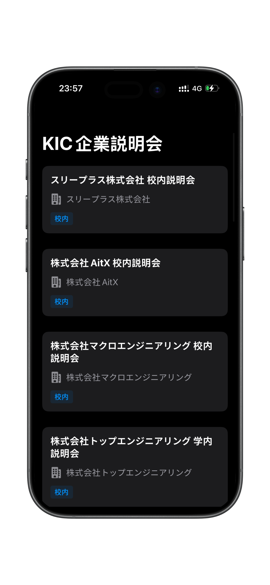

# KIC Events Explorer

学校のデータをスクレイピングし、AIで自動クリーニングしてSupabaseデータベースに保存。それをSwiftで制作したアプリで表示するツールです。

  
  

> **ステータス:** 🚧 開発中

## 主な機能 (Features)

### 1. 学内データの連携と閲覧
学校のアカウントでログイン・認証を行い、学校サイト上の説明会リストをこのアプリのアカウントを使って閲覧できます。

### 2. AIによるタグ自動生成
AIが学校サイト内のキーワードを整理し、企業ごとにタグを生成します。
* 例：「留学生可」「未経験者歓迎」

### 3. 関心タグによる優先表示
ユーザーが入力した「特に関心のあるタグ」に基づき、条件に合致する企業をリストの上位に表示します。

### 4. カレンダー同期
説明会への参加申請後、Apple純正のカレンダーアプリへ予定を同期できます。

### 5. 選考進捗のトラッキング
申し込み済み企業の選考進捗（例：一次面接通過、二次面接通過）を追跡できる詳細画面を実装予定です。ユーザー自身が企業の選考フローを調整し、手動でステータスを更新して管理できます。

---

## 今後の展望 (Roadmap)
現在はMVVMアーキテクチャに則って開発を進めています。
今後やりたい機能があれば随時記録し、夏休み終わりまでに実用レベルの成果物を完成させることを目指しています。
